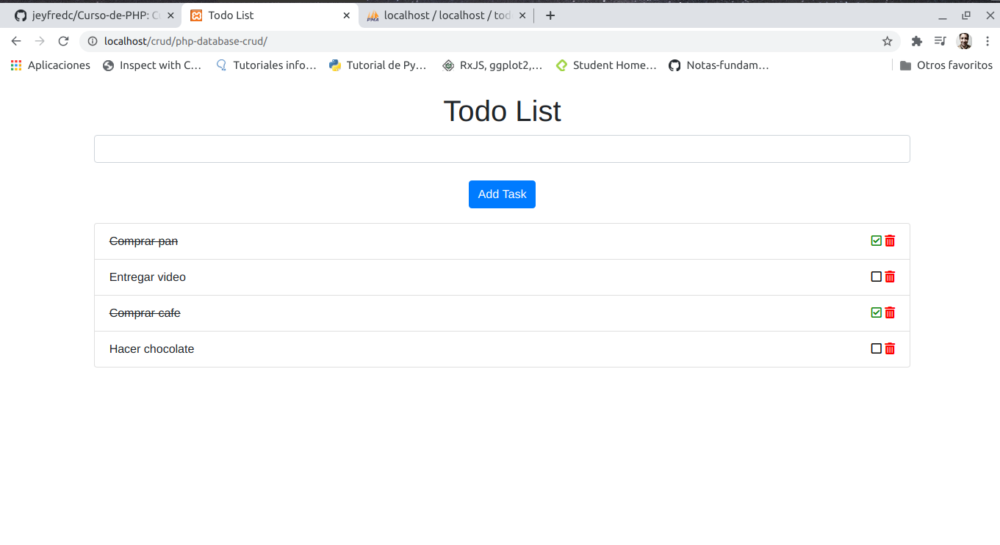

# CRUD-PHP

Aplicacion Task para agregar, modificar, marcar y eliminar tareas utilizando PHP + Simfony

Puedes ver la recopilacion del curso en https://github.com/jeyfredc/Curso-de-PHP#Clase-30-Insertar-datos-en-MySql-con-PHP

___

## ¿Quieres conocer mas proyectos?

Puedes visualizar mi portafolio en el siguiente enlace https://jeyfredc.github.io/Portafolio/**

